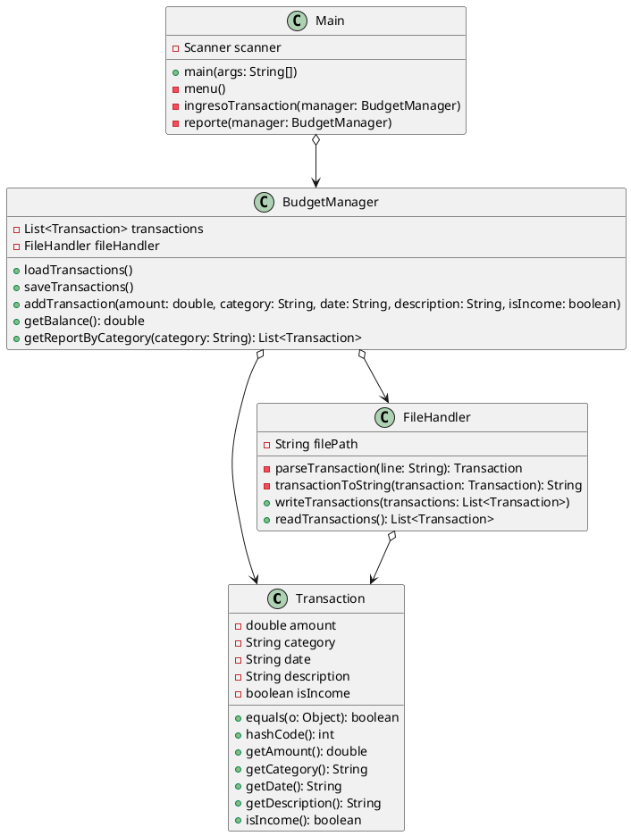

## Calculadora de Gastos Personales

Una aplicación Java para gestionar transacciones financieras personales, con persistencia en archivos CSV y una interfaz de consola interactiva. Este proyecto demuestra habilidades en manejo de colecciones, entrada/salida, y resolución de problemas complejos como duplicados y formatos numéricos.

## Descripción

La **Calculadora de Gastos Personales** permite a los usuarios registrar ingresos y gastos, consultar el balance, generar reportes por categoría, y almacenar transacciones en un archivo CSV. La aplicación está diseñada para ser robusta, eliminando duplicados y manejando formatos numéricos de manera consistente, lo que la hace adecuada para aplicaciones financieras básicas.

## Funcionalidades

- **Añadir transacciones**: Registra ingresos o gastos con monto, categoría, fecha, descripción, y tipo (ingreso/gasto).
- **Consultar balance**: Calcula la diferencia entre ingresos y gastos usando Java Streams.
- **Reportes por categoría**: Lista transacciones filtradas por categoría.
- **Persistencia en CSV**: Carga y guarda transacciones en `ficheroTransactions.csv`, eliminando duplicados.
- - **Interfaz de consola**: Menú interactivo modular con manejo de entrada/salida y validación de errores.
- **Manejo de formatos numéricos**: Usa `Locale.US` para consistencia en la lectura/escritura de montos (ej. `50.50`).

## Tecnologías utilizadas

- **Java SE 11**: Lenguaje principal, con énfasis en buenas prácticas.
- **Colecciones**: `ArrayList`, `HashSet` para gestionar transacciones y eliminar duplicados.
- **Streams**: Usados en `getBalance` y `getReportByCategory` para cálculos y filtrado.
- **Entrada/Salida**: `BufferedReader`, `BufferedWriter` para leer/escribir CSV.
- **Formato numérico**: `NumberFormat` y `Locale` para manejar montos.
- **Excepciones**: Manejo robusto de `NumberFormatException`, `ParseException`, e `IOException`.
- **Interfaz de consola**: `Scanner` para interacción modular con el usuario.
- **Documentación**: Javadoc para clases y métodos, mejorando la legibilidad del código.

## Estructura del proyecto

```
├── src/
│   ├── Main.java
│   ├── BudgetManager.java
│   ├── FileHandler.java
│   ├── Transaction.java
├── ficheroTransactions.csv
├── README.md
└── .gitignore
```

### Diagrama UML



## Requisitos

- **JDK 11** o superior.
- Un IDE como IntelliJ IDEA, Eclipse, o VS Code con soporte para Java.
- Un archivo `ficheroTransactions.csv` en el directorio raíz del proyecto (puede estar vacío).

## Instalación

1. **Clonar el repositorio**:

   ```bash
   git clone https://github.com/tu-usuario/calculadora-gastos-personales.git
   cd calculadora-gastos-personales
   ```

2. **Configurar el archivo CSV**:

   - Crea un archivo `ficheroTransactions.csv` en el directorio raíz.
   - Opcionalmente, inicialízalo con el siguiente contenido:

     ```
     50.50,Freelance,13-06-2025,Supermercado,false
     200.50,Freelance,13-06-2025,Proyecto,true
     100.00,Salario,13-06-2025,Sueldo mensual,true
     ```

3. **Compilar y ejecutar**:

   - Abre el proyecto en tu IDE y configura el JDK 11.
   - Ejecuta `Main.java`.
   - Alternativamente, desde la terminal:

     ```bash
     javac -d bin src/*.java
     java -cp bin Main
     ```

## Uso

Al ejecutar `Main`, aparecerá un menú interactivo en la consola:

```
=== Calculadora de Gastos Personales ===
1. Añadir transacción
2. Mostrar balance
3. Generar reporte por categoría
4. Cargar transacciones desde archivo
5. Guardar transacciones en archivo
6. Salir
Seleccione una opción (1-6): 
```

- **Añadir transacción**: Ingresa monto (ej. `50.50`), categoría, fecha (`dd-MM-yyyy`), descripción, y tipo (`true` para ingreso, `false` para gasto).
- **Mostrar balance**: Muestra la diferencia entre ingresos y gastos.
- **Reporte por categoría**: Lista transacciones de una categoría específica.
- **Cargar/Guardar transacciones**: Lee o escribe en `ficheroTransactions.csv`.

### Ejemplo de interacción

```plaintext
=== Calculadora de Gastos Personales ===
1. Añadir transacción
2. Mostrar balance
3. Generar reporte por categoría
4. Cargar transacciones desde archivo
5. Guardar transacciones en archivo
6. Salir
Seleccione una opción (1-6): 1

Ingrese el monto (ej. 50.50): 50.50
Ingrese la categoría (ej. Freelance): Freelance
Ingrese la fecha (dd-MM-yyyy, ej. 13-06-2025): 13-06-2025
Ingrese la descripción (ej. Supermercado): Supermercado
¿Es ingreso? (true/false): false
Transacción añadida correctamente.

=== Calculadora de Gastos Personales ===
1. Añadir transacción
2. Mostrar balance
3. Generar reporte por categoría
4. Cargar transacciones desde archivo
5. Guardar transacciones en archivo
6. Salir
Seleccione una opción (1-6): 2

Balance actual: -50.50
```

